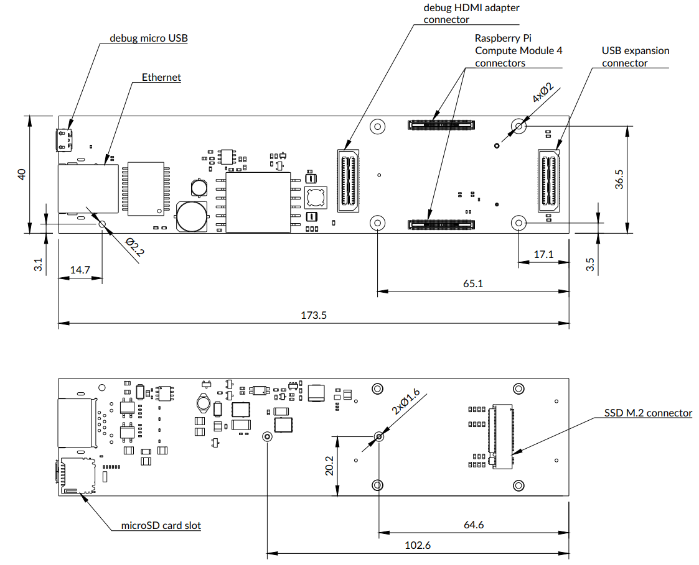

# Scalenode CM4 Baseboard

Copyright (c) 2020-2022 [Antmicro](https://www.antmicro.com)

## Overview

This repository contains the PCB design files for a baseboard supporting System on Modules with pinout compatible with Raspberry Pi Compute Module 4 (CM4).
The baseboard has been optimized for 19-inch rack mount installations for distributed multi-node computing systems.

## Key features

* Supports Raspberry Pi CM4
* Gigabit Ethernet with integrated PoE circuitry
* On-board M.2 (key-M) slot supporting NVMe SSDs 
* Slim PCB outline for 1U chassis
* Expansion connector for peripherals connected over USB
* Expansion connector for HDMI adapters

## Board layout and dimensions

## License

`Apache-2.0 <LICENSE>`_
