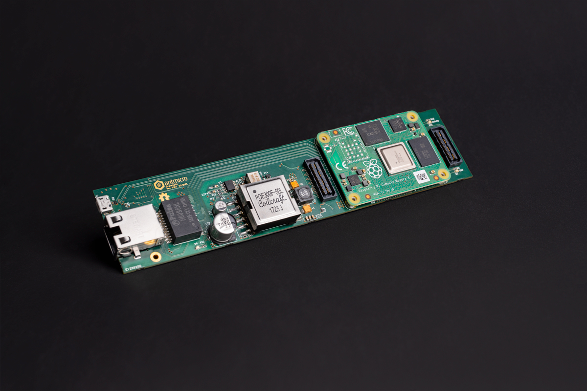
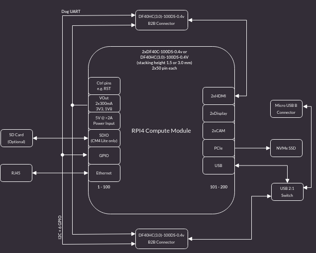

# Scalenode CM4 Baseboard

Copyright (c) 2020-2023 [Antmicro](https://www.antmicro.com)

## Overview

This project contains the PCB design files for a baseboard supporting System on Modules with pinout compatible with Raspberry Pi Compute Module 4 (CM4).
The baseboard has been optimized for 19-inch rack mount installations for distributed multi-node computing systems.

## Project structure

The main directory contains KiCad PCB project files, a [LICENSE](LICENSE), and a README.
The remaining files are stored in the following directories:

* `lib` - contains the KiCad component libraries
* `doc` - contains generated schematics and other documentation
* `img` - contains graphics for this README
* `assets` - contains visual assets for showcasing this design on [Open Hardware Portal](https://openhardware.antmicro.com)

## Key features

* Supports Raspberry Pi CM4
* Gigabit Ethernet with integrated PoE circuitry
* On-board M.2 (key-M) slot supporting NVMe SSDs 
* Slim PCB outline for 1U chassis
* Expansion connector for peripherals connected over USB
* Expansion connector for HDMI adapters

## Block diagram

## License

This project is published under the [Apache-2.0](LICENSE) license.
