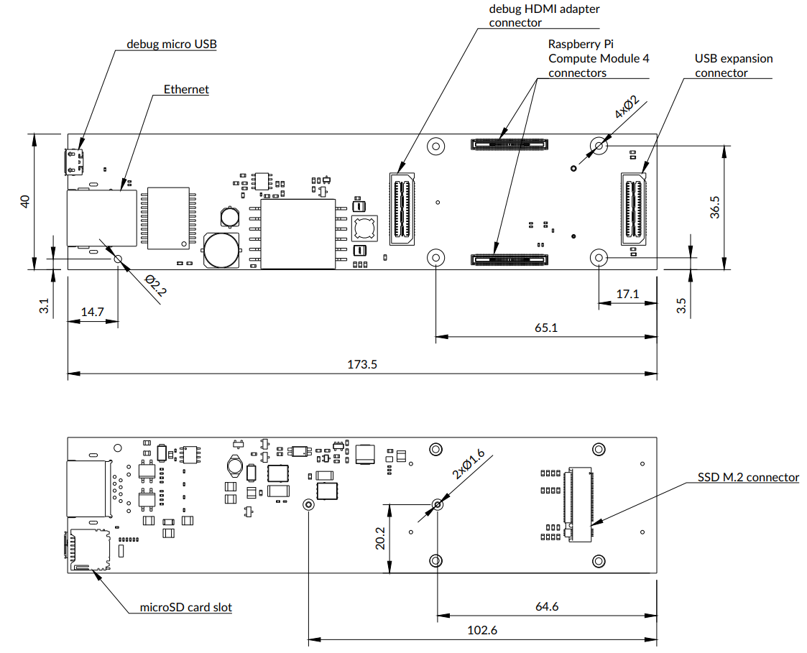

==================
Scalenode platform
==================

Copyright (c) 2020-2021 `Antmicro <https://www.antmicro.com>`_

.. image:: img/scalenode.png
   :scale: 60%
   :align: center

Overview
========

This repository includes PCB design files for a baseboard supporting Raspberry Pi Compute Module 4.
The baseboard has been optimized for 19-inch rack mount installations for distributed multi-node computing systems.

Key features

* Supports Raspberry Pi CM4
* Gigabit Ethernet with integrated PoE circuitry
* On-board M.2 slot supporting NVMe SSDs 
* Slim PCB outline for 1U chassis
* Expansion connector for peripherals connected over USB
* Expansion connector for MIPI-CSI & HDMI adapters

Board layout and dimensions
===========================

Design status
=============

The PCB design files were prepared in KiCad.
Prototypes of revision 1.0.0 are now being manufactured.

License
=======

`Apache-2.0 <LICENSE>`_
